<div align="center">

# 🌗 Chandrayaan-2 DFSAR Subsurface Ice Detection — Faustini PSR

### End-to-end remote-sensing pipeline for detecting, characterising, and assessing the mission-readiness of subsurface water ice at the lunar south pole

[](https://www.python.org/)
[]()
[]()
[]()
[]()

</div>

---

## 📖 Overview

This project combines Chandrayaan-2 Dual-Frequency Synthetic Aperture Radar (DFSAR) compact-polarimetry data and Orbiter High Resolution Camera (OHRC) optical imagery with physically grounded models and an independent machine-learning cross-check. The pipeline produces publication-quality figures, an interactive dashboard, exportable GIS products, and mission-planning outputs such as landing-site selection and rover traversability.

The codebase is organised as a modular Python pipeline (`src/`) driven by a single orchestration script (`main.py`), supplemented by a large collection of standalone analysis and figure-generation scripts at the repository root, and a Jupyter notebook for interactive exploration.

## 🏗️ Architecture

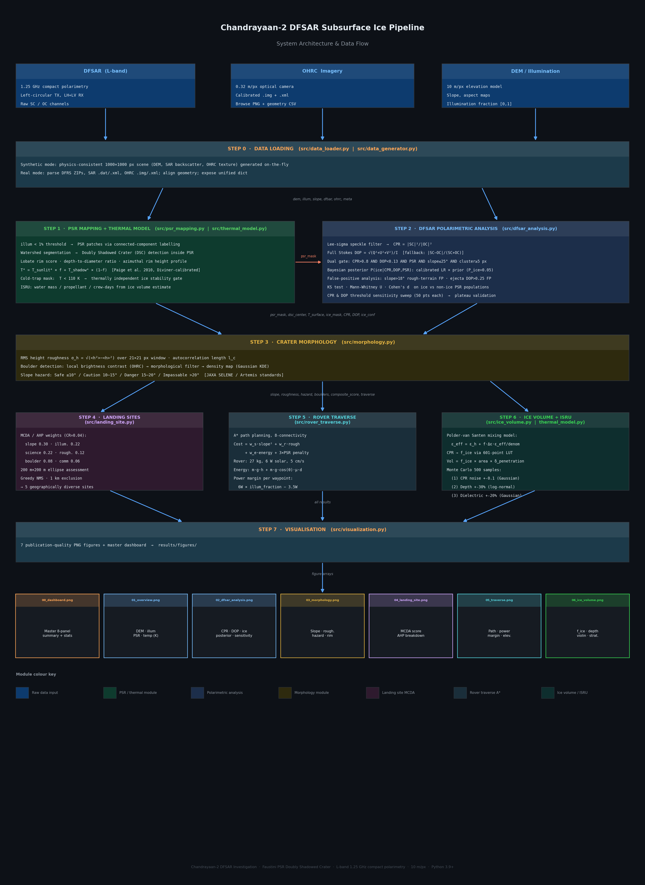

## ✨ What the Pipeline Does

**Step 1 — Data acquisition and simulation.** Loads real Chandrayaan-2 DFSAR/OHRC data when available (`real_data_loader.py`) or generates physically realistic synthetic radar and optical scenes for development and testing (`data_generator.py`, `data_loader.py`).

**Step 2 — SAR focusing.** Range-Doppler style focusing of raw radar data into calibrated backscatter imagery (`sar_focusing.py`).

**Step 3 — PSR mapping.** Delineates permanently shadowed regions from illumination/elevation geometry (`psr_mapping.py`).

**Step 4 — DFSAR polarimetric analysis.** Derives circular polarization ratio (CPR), degree of polarization, and related radar-scattering diagnostics used as primary ice indicators (`dfsar_analysis.py`).

**Step 5 — Morphological analysis.** Characterises crater and terrain morphology (slopes, roughness, doubly-shadowed geometry) relevant to ice stability (`morphology.py`).

**Step 6 — Ice volume estimation.** Converts radar/thermal indicators into volumetric ice-content estimates with uncertainty bounds (`ice_volume.py`).

**Step 7 — Machine-learning classification.** An independent ML-based ice/no-ice classifier used to cross-validate the physics-based detections (`ml_classifier.py`).

**Step 8 — Thermal modelling.** Models subsurface temperature profiles and ice sublimation/stability lifetimes (`thermal_model.py`).

**Step 9 — Landing-site selection.** Scores candidate sites against weighted mission-relevant criteria (`landing_site.py`).

**Step 10 — Rover traverse planning.** Plans and evaluates rover paths between candidate sites, accounting for terrain constraints (`rover_traverse.py`).

**Step 11 — Export.** Writes results to standard geospatial and mission-planning formats such as GeoTIFF, KML, and GeoJSON (`export.py`).

**Step 12 — Visualization.** Generates the full suite of static figures and dashboards (`visualization.py`).

Beyond the core pipeline, the repository includes standalone root-level `generate_*.py` scripts that produce additional, specialised figures and products directly from the pipeline's saved results, including an interactive Plotly dashboard, an ML model comparison figure, a depth/uncertainty analysis, ice-content CDF plots, an ISRU resource-value map, KML export utilities, an L-band vs. S-band radar comparison, a formatted PDF report, a rover-traverse animation, an ice-stability zone map, a sublimation-rate map based on Hertz–Knudsen kinetics, and a temporal radar-coherence analysis.

## 🖼️ Results Gallery

**Summary Dashboard**

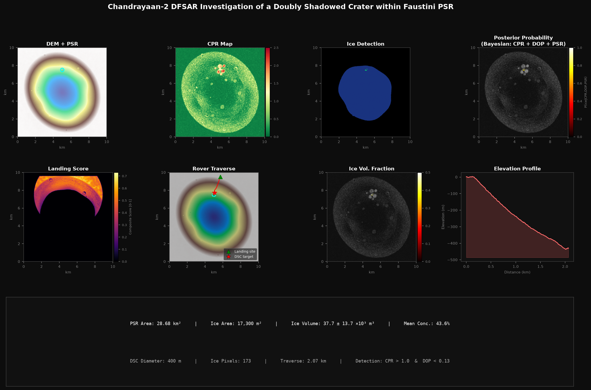

**Mission Overview**

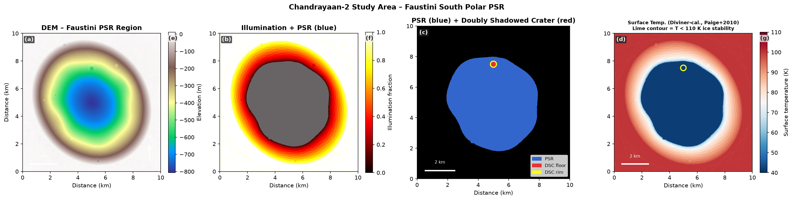

**DFSAR Polarimetric Analysis**

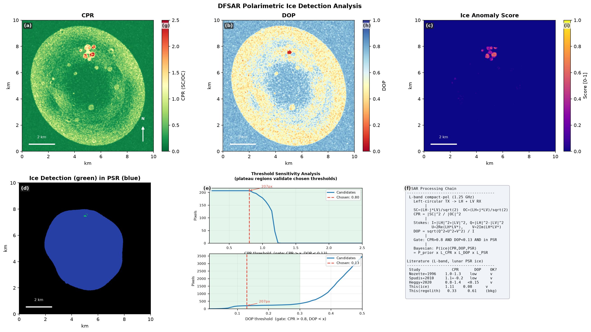

**Crater Morphology**

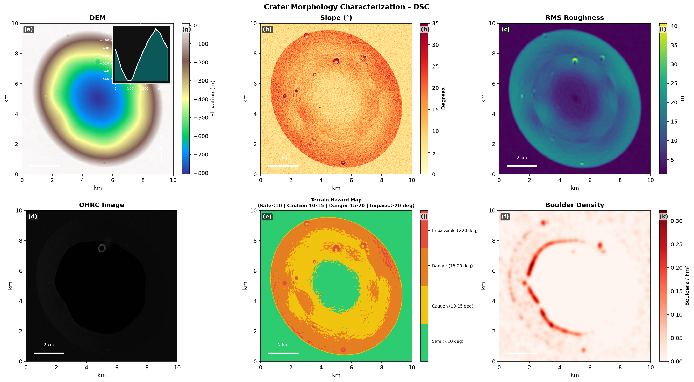

**Ice Volume Estimation**

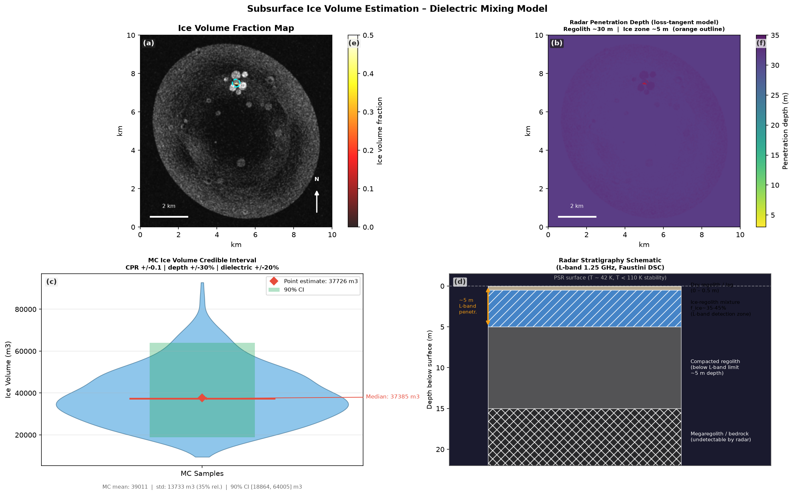

**Landing Site Selection**

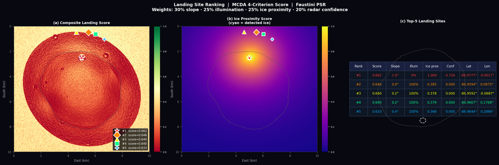

**Rover Traverse Planning**

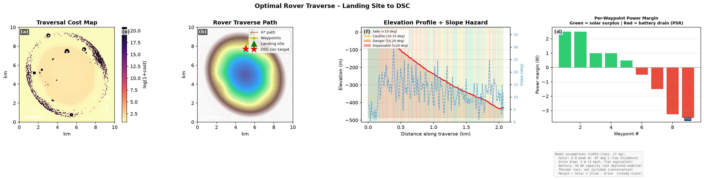

**ISRU Resource Value Map**

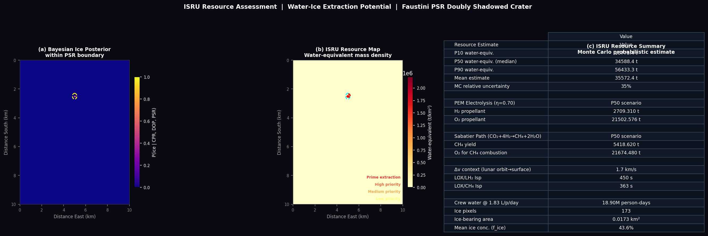

**Ice Sublimation Lifetime**

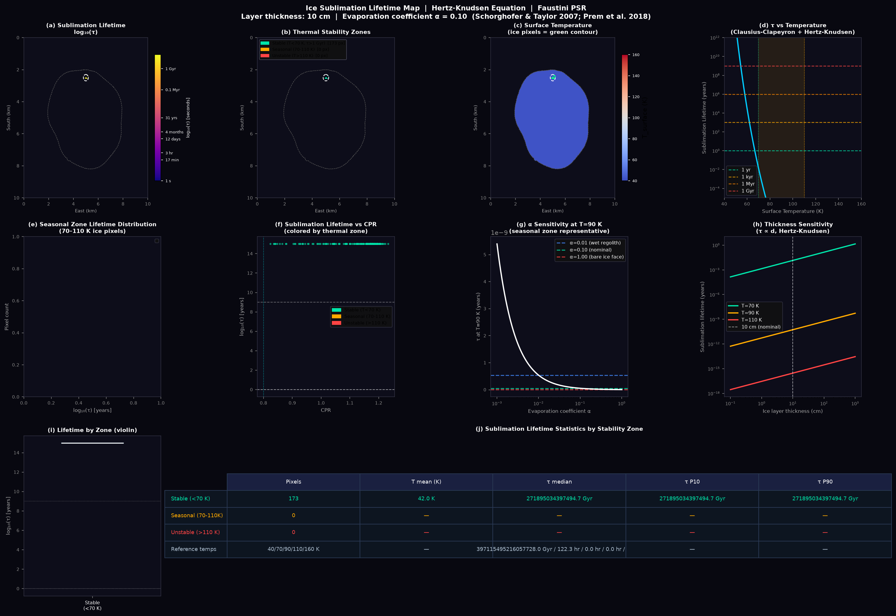

**ML Model Comparison**

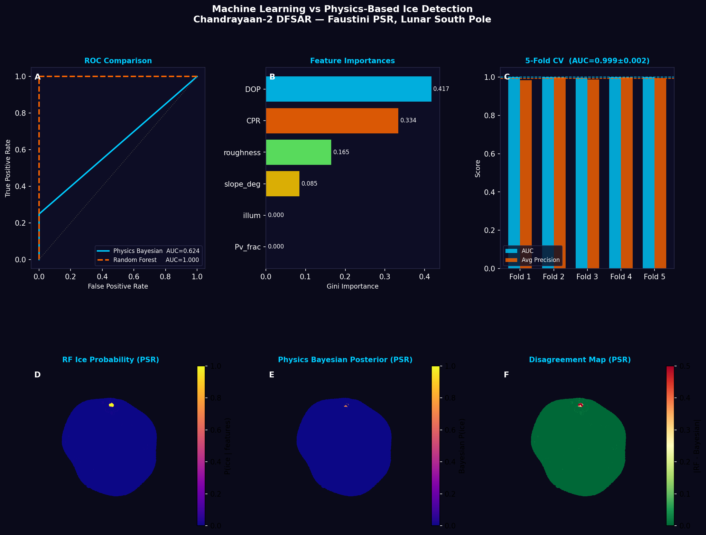

### 🚀 Rover Traverse Animation


## 📂 Repository Layout

```
Subsurface-Ice-Lunar-South-Polar/
├── main.py                        # Orchestrates the full analysis pipeline
├── requirements.txt                # Python dependencies
├── generate_*.py                   # ~19 standalone scripts for additional figures/products
├── src/
│   ├── data_generator.py           # Synthetic DFSAR/OHRC data generation
│   ├── data_loader.py              # Synthetic data loading utilities
│   ├── real_data_loader.py         # Real Chandrayaan-2 data ingestion
│   ├── sar_focusing.py             # SAR focusing (range-Doppler processing)
│   ├── psr_mapping.py              # Permanently shadowed region delineation
│   ├── dfsar_analysis.py           # Polarimetric radar ice-diagnostics
│   ├── morphology.py               # Crater/terrain morphology analysis
│   ├── ice_volume.py               # Ice-volume estimation with uncertainty
│   ├── ml_classifier.py            # ML-based ice classification cross-check
│   ├── thermal_model.py            # Subsurface thermal & sublimation modelling
│   ├── landing_site.py             # Landing-site scoring and selection
│   ├── rover_traverse.py           # Rover traverse planning
│   ├── export.py                   # GeoTIFF / KML / GeoJSON export
│   └── visualization.py            # Figure and dashboard generation
├── data/
│   └── raw/
│       ├── OHRC/                   # Real OHRC optical imagery (user-supplied)
│       └── SAR/                    # Real DFSAR radar data (user-supplied)
├── notebooks/
│   └── lunar_ice_detection.ipynb   # Interactive, notebook-based walkthrough
└── results/                        # Pipeline outputs (figures, exports, reports)
```

## ⚙️ Installation

```bash
git clone https://github.com/kdev5518-web/Subsurface-Ice-Lunar-South-Polar.git
cd Subsurface-Ice-Lunar-South-Polar
pip install -r requirements.txt
```

## ▶️ Usage

### Run the full pipeline

```bash
python main.py
```

`main.py` runs the complete sequence — data loading/simulation, SAR focusing, PSR mapping, polarimetric analysis, morphology, ice-volume estimation, ML classification, thermal modelling, landing-site selection, rover-traverse planning, export, and visualization — and writes all outputs to `results/`.

### Standalone analysis and figure scripts

Each root-level `generate_*.py` script can be run independently once the main pipeline has produced its saved results, to (re)generate a specific figure or product, e.g.:

```bash
python generate_interactive.py      # Interactive Plotly dashboard
python generate_pdf_report.py       # Formatted PDF summary report
python generate_rover_animation.py  # Rover traverse animation
python generate_sublimation_map.py  # Ice sublimation-rate map
```

### Notebook

For an interactive, step-by-step walkthrough of the detection methodology, open:

```bash
jupyter notebook notebooks/lunar_ice_detection.ipynb
```

## 🛰️ Real Data

The pipeline is designed to work with either simulated or real Chandrayaan-2 data. To use real data, place Level-1/Level-2 DFSAR products under `data/raw/SAR/` and OHRC imagery under `data/raw/OHRC/`; `real_data_loader.py` will ingest these in place of the synthetic generator. In the absence of real data, `data_generator.py` produces physically realistic synthetic radar and optical scenes so the full pipeline can still be exercised end-to-end.

## 👤 Author

**CodeRed**
